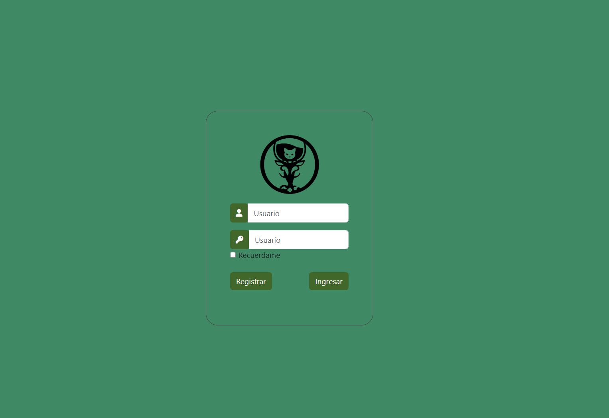

creacion de un login basico con bootsrap

## correr el proyecto con live server
1. clonar el repositorio
2. abrir el proyecto con visual studio code
3. hacer click derecho en el archivo index.html
4. seleccionar "Open with Live Server"

## tecnologias utilizadas
- HTML
- CSS
- Bootstrap

